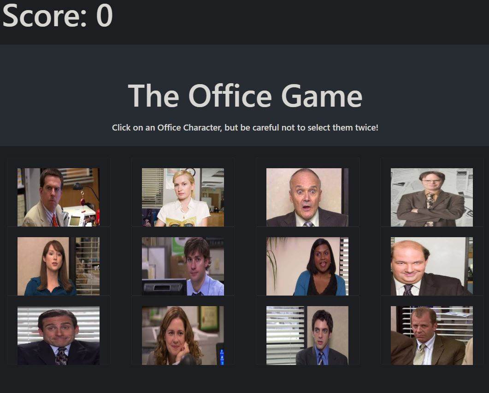

# TheOfficeGame

The Office Game is a memory game built with React. Click on any character to start, but once you've clicked on that character, do not select him again, or the game will restart.

## Live Deployment

https://arcane-gorge-58215.herokuapp.com/

  

## Rules
1. Click on any character to start.
2. Once you've clicked on that character, select a different character that you haven't selected before to increase your score.
3. Try getting your score to 12 to receive the max amount of points!

